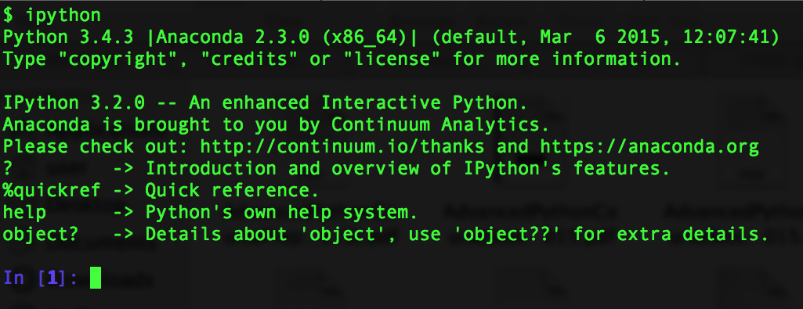
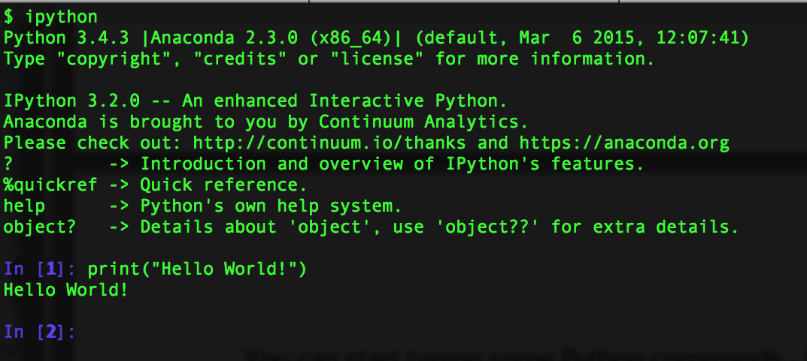
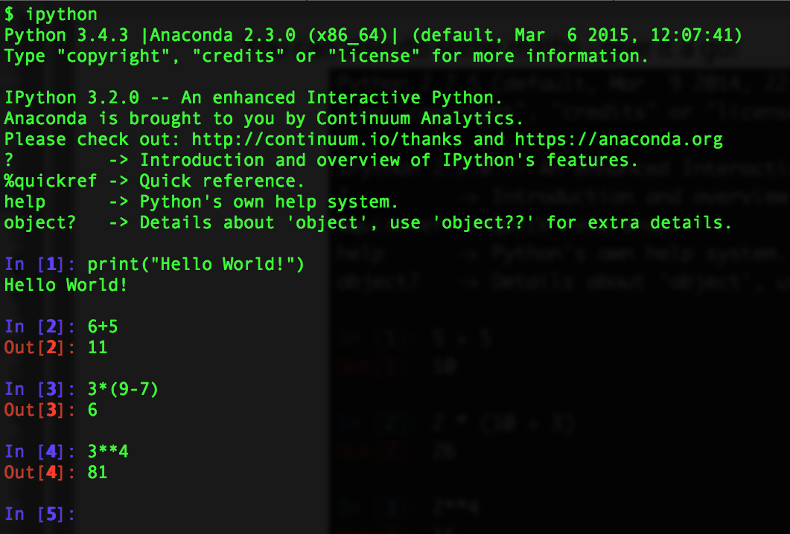
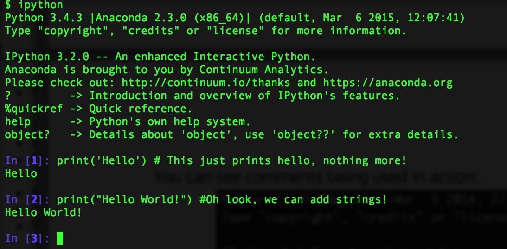

## Learning Objectives {.objectives}

*   Introducing Python and pip
*   Introduction to running the Python interpreter
*   Using Python interactively
*   Introduction to Python variables
*   Creating and Assigning values to variables
*   Working with Arrays
*   Basic program control - Conditionals and Loops
*   Creating and Using Functions
*   Using libraries

## Introducing Python

Python is a powerful, fast, open-source & easy to learn programming language - Python is ideal for first time programmers.
Python’s design philosophy has an emphasis on code readability, and its syntax allows programmers to express concepts in fewer lines of code than would be possible in languages such as C++ or Java.

The core philosophy of the language is summarized by [PEP 20(The Zen of Python)](http://www.python.org/dev/peps/pep-0020), which includes aphorisms such as:

- Beautiful is better than ugly.
- Explicit is better than implicit.
- Simple is better than complex.
- Complex is better than complicated.
- Readability counts.

In this course, we will be learning the basics of Python, in a **scientific data analysis**, **web scraping**  and **web development** contexts. For web development, we will be using a very simple web framework by the name of [Flask](http://flask.pocoo.org), which is 
very light weight and easy to use.

## pip

pip is a package management system used to install and manage software packages written in Python. We will be using pip to install things like Flask and any other dependencies we want to make use of. You should already have pip installed as per the course preparatory work.

## Running the Python interpreter

Normally, you write Python programs in a Python script, which is basically a file of Python commands you can run.
But to start with, we'll take a look at the Python interpreter.
It's similar to the shell in how it works, in that you type in commands and it
gives you results back, but instead you use the Python language.

It's a really quick and convenient way to get started with Python, particularly when learning about things like how to use variables, and it's good for playing around with what you can do and quickly testing small things.
But as you progress to more interesting and complex things you need to move over to writing proper Python scripts, which we'll see later.

You start the Python interpreter from the shell by:

~~~ {.bash}
$ python
~~~

And then you are presented with something like:

~~~ {.output}
Python 3.4.3 |Anaconda 2.3.0 (x86_64)| (default, Mar  6 2015, 12:07:41) 
[GCC 4.2.1 (Apple Inc. build 5577)] on darwin
Type "help", "copyright", "credits" or "license" for more information.
>>> 
~~~

And lo and behold! You are presented with yet another prompt.
So, we're actually running a Python interpreter from the shell - it's only yet another program we can run from the shell after all.
But shell commands won't work again until we exit the interpreter.

You can exit the interpreter and get back to the shell by typing:

~~~ {.python}
>>> exit()
~~~

...or alternatively pressing the Control and D keys at the same time.
Then you'll see:

~~~ {.output}
$ 
~~~

Phew - back to the shell!

## Using Python interactively

You can simply type `ipython` inside your Terminal/ Command Line and hit enter to find yourself in an interactive Python session:

You can start typing some Python commands - for example you can use Python's `print` command:

You can also do some maths - give it a go!

In a nutshell, you can interactively code in Python, without having to write a program, save it and run it. It’s especially useful when you want to try something out.

## Comments

In Python, any part of a line that comes after a `#`​is ignored. This is useful when you are writing complicated programs, as it allows you to write human-readable comments to document your code - this makes it easier for others to follow your code.

You can see comments being used in action:

## Variables

A variable is just a name for a value,
such as `x`, `current_temperature`, or `subject_id`.
Python's variables must begin with a letter.
A variable in Python is defined through assignment i.e. we can create a new variable simply by assigning a value to it using `=`.
As an illustration,
consider the simplest `collection` of data,
a single value.
The line below assigns a value to a variable:

~~~ {.python}
weight_kg = 55
~~~

Once a variable has a value, we can print it:

~~~ {.python}
print(weight_kg)
~~~
~~~ {.output}
55
~~~

and do arithmetic with it:

~~~ {.python}
print('weight in pounds:', 2.2 * weight_kg)
~~~
~~~ {.output}
weight in pounds: 121.0
~~~

In the above example, a floating point number `55` object has a tag labelled `weight_kg`.

If we reassign to `weight_kg`, we just move the tag to another object as shown below.
 
We can change a variable's value by assigning it a new one:

~~~ {.python}
weight_kg = 57.5
print('weight in kilograms is now:', weight_kg)
~~~
~~~ {.output}
weight in kilograms is now: 57.5
~~~

Now the name `weight_kg` is attached to another floating point number `57.5` object.

Hence, in Python, a `name` or `identifier` or `variable` is like a name tag attached to an object.
Python has `names` and everything is an `object`.

As the example above shows,
we can print several things at once by separating them with commas.

If we imagine the variable as a sticky note with a name written on it,
assignment is like putting the sticky note on a particular value.

This means that assigning a value to one variable does *not* change the values of other variables.
For example,
let's store the subject's weight in pounds in a variable:

~~~ {.python}
weight_lb = 2.2 * weight_kg
print('weight in kilograms:', weight_kg, 'and in pounds:', weight_lb)
~~~
~~~ {.output}
weight in kilograms: 57.5 and in pounds: 126.5
~~~

and then change `weight_kg`:

~~~ {.python}
weight_kg = 100.0
print('weight in kilograms is now:', weight_kg, 'and weight in pounds is still:', weight_lb)
~~~
~~~ {.output}
weight in kilograms is now: 100.0 and weight in pounds is still: 126.5
~~~
Since `weight_lb` doesn't remember where its value came from,
it isn't automatically updated when `weight_kg` changes.
This is different from the way spreadsheets work.

Although we commonly refer to `variables` even in Python (because it is the common terminology), we really mean `names` or `identifiers`. In Python, `variables` are name tags for values, not labelled boxes.

## What's inside the box? {.challenge}

Draw diagrams showing what variables refer to what values after each statement 
in the following program:

~~~ {.python}
weight = 70.5
age = 35
# Take a trip to the planet Neptune
weight = weight * 1.14
age = age + 20
~~~

## Sorting out references {.challenge}

What does the following program print out?

~~~ {.python}
first, second = 'Grace', 'Hopper'
~~~

~~~{.output}
first = Grace
second = Hopper
~~~

~~~{.python}
third, fourth = second, first
print(third, fourth)
~~~

## Arrays in Python

One of the most fundamental data structures in any language is the array. Python doesn't have 
a native array data structure, but it has the list which is much more general and can be used 
as a multidimensional array quite easily.

### List basics

A list in python is just an ordered collection of items which can be of any type. By comparison 
an array is an ordered collection of items of a single type - so a list is more flexible than an 
array.

A list is also a dynamic mutable type and this means we can add and delete elements from the list 
at any time. 

Lists are built into the language (so we don't have to load a library to use them).

To define a list we simply write a comma separated list of items in square brackets:

~~~{.python}
odds = [1, 3, 5, 7, 9, 11, 15]
print('Odds are:', odds)

~~~

~~~{.output}
Odds are: [1, 3, 5, 7, 9, 11, 15]
~~~

This looks like an array because we can use *slicing* notation to pick out an individual element - 
indexes start from 0.

Programming languages like Fortran and MATLAB start counting at 1,
because that's what human beings have done for thousands of years.
Languages in the C family (including C++, Java, Perl, and Python) count from 0
because that's simpler for computers to do.

It takes a bit of getting used to,
but one way to remember the rule is that
the index is how many steps we have to take from the start to get the item we want.

We select individual elements from lists by indexing them:

~~~{.python}
print('first and last:', odds[0], odds[-1])
~~~

will print first and last elements, i.e. value 1 and 7 in this case. 

~~~ {.output}
first and last: 1 15
~~~

Similarly to change the seventh element we can 
assign directly to it:

~~~{.python}
odds[6] = 13
~~~

The *Slicing* notation looks like array indexing but it is a lot more flexible. For example:

~~~{.python}
odds[2:5]
~~~

~~~{.output}
[5, 7, 9]
~~~

is a sublist from the third element to the fifth i.e. from `odds[2]` to `odds[4]`. Notice that the 
final element specified i.e. `[5]` is not included in the slice.

Also notice that you can leave out either of the start and end indexes and they will be assumed to have their maximum possible value. 
For example:

~~~{.python}
odds[5:]
~~~

~~~{.output}
[11, 13]
~~~

is the list from `odds[5]` to the end of the list and

~~~{.python}
odds[:5]
~~~

~~~{.output}
[1, 3, 5, 7, 9]
~~~

is the list up to and not including odds[5] and

~~~{.python}
odds[:]
~~~

~~~{.output}
[1, 3, 5, 7, 9, 11, 13]
~~~

is the entire list.

### Slicing strings 

A section of an array is called a slice.
We can take slices of character strings as well:

~~~ {.python}
element = 'oxygen'
print('first three characters:', element[0:3])
print('last three characters:', element[3:6])
~~~

~~~ {.output}
first three characters: oxy
last three characters: gen
~~~

##Slicing strings challenge{.challenge}

What is the value of `element[:4]`?
What about `element[4:]`?
Or `element[:]`?

What is `element[-1]`?
What is `element[-2]`?
Given those answers,
explain what `element[1:-1]` does.

List slicing is more or less the same as string slicing except that we can modify a slice. For example:

~~~{.python}
odds[0:2]=[17,19]
~~~

has the same effect as

~~~{.python}
odds[0]=17
odds[1]=19
~~~

**NOTE:**

Finally it is worth knowing that the list we assign to a slice doesn't have to be the same size as the slice - 
it simply replaces it even if it is a different size.

### Thin slices 

The expression `element[3:3]` produces an empty string,
 i.e., a string that contains no characters.
 
### Lists and Strings
 
There is one important difference between lists and strings:
we can change the values in a list,
but we cannot change the characters in a string.
For example:

~~~ {.python}
names = ['Newton', 'Darwing', 'Turing'] # typo in Darwin's name
print('names is originally:', names)
names[1] = 'Darwin' # correct the name
print('final value of names:', names)
~~~

~~~ {.output}
names is originally: ['Newton', 'Darwing', 'Turing']
final value of names: ['Newton', 'Darwin', 'Turing']
~~~

works, but:

~~~ {.python}
name = 'Bell'
name[0] = 'b'
~~~

~~~{.error}
>>> name[0]='b'
Traceback (most recent call last):
  File "<stdin>", line 1, in <module>
TypeError: 'str' object does not support item assignment
~~~

does not.

## Ch-Ch-Ch-Changes {.callout}

Data which can be modified in place is called mutable,
while data which cannot be modified is called immutable.
Strings and numbers are immutable. This does not mean that variables with string or number values are constants,
but when we want to change the value of a string or number variable, we can only replace the old value 
with a completely new value.

Lists and arrays, on the other hand, are mutable: we can modify them after they have been created. We can 
change individual elements, append new elements, or reorder the whole list.  For some operations, like 
sorting, we can choose whether to use a function that modifies the data in place or a function that returns a 
modified copy and leaves the original unchanged.

Be careful when modifying data in place.  If two variables refer to the same list, and you modify the list 
value, it will change for both variables! If you want variables with mutable values to be independent, you 
must make a copy of the value when you assign it.

Because of pitfalls like this, code which modifies data in place can be more difficult to understand. However, 
it is often far more efficient to modify a large data structure in place than to create a modified copy for 
every small change. You should consider both of these aspects when writing your code.

There are many ways to change the contents of lists besides assigning new values to
individual elements:

~~~ {.python}
odds.append(21)
print('odds after adding a value:', odds)
~~~
~~~ {.output}
odds after adding a value: [17, 19, 5, 7, 9, 11, 13, 15, 21]
~~~

~~~ {.python}
del odds[0]
print('odds after removing the first element:', odds)
~~~
~~~ {.output}
odds after removing the first element: [19, 5, 7, 9, 11, 13, 15, 21]
~~~

~~~ {.python}
odds.reverse()
print('odds after reversing:', odds)
~~~
~~~ {.output}
odds after reversing: [21, 15, 13, 11, 9, 7, 5, 19]
~~~

While modifying in place, it is useful to remember that python treats lists in a slightly counterintuitive way.

If we make a list and (attempt to) copy it then modify in place, we can cause all sorts of trouble:

~~~ {.python}
odds = [1, 3, 5, 7]
primes = odds
primes += [2]
print('primes:', primes)
print('odds:', odds)
~~~
~~~ {.output}
primes: [1, 3, 5, 7, 2]
odds: [1, 3, 5, 7, 2]
~~~

This is because python stores a list in memory, and then can use multiple names to refer to the same list.
If all we want to do is copy a (simple) list, we can use the list() command, so we do not modify a list we did not mean to:

~~~ {.python}
odds = [1, 3, 5, 7]
primes = list(odds)
primes += [2]
print('primes:', primes)
print('odds:', odds)
~~~
~~~ {.output}
primes: [1, 3, 5, 7, 2]
odds: [1, 3, 5, 7]
~~~

This is different from how variables worked in lesson 1, and more similar to how a spreadsheet works.

### Basic array operations

So far so good, and it looks as if using a list is as easy as using an array.

Where things start to go wrong just a little is when we attempt to push the similarities 
between lists and arrays one step too far. For example, suppose we want to create an array 
initialised to a particular value. Following the general array idiom in most languages we 
might initialise the elements to a value, say, 1. e.g.:

~~~ {.python}
myList=[]
myList[1]=1
myList[2]=1
...
~~~

only to discover that this doesn't work because we can't assign to a list element that doesn't already exist.

~~~{.error}
Traceback (most recent call last):
  File "<stdin>", line 1, in <module>
IndexError: list assignment index out of range
~~~

One solution is to use the append method to add elements one by one:

~~~ {.python}
myList=[]
myList.append(1)
myList.append(1)
...
~~~

This works but it only works if we need to build up the list in this particular order - which most of the time you want to do anyway.

